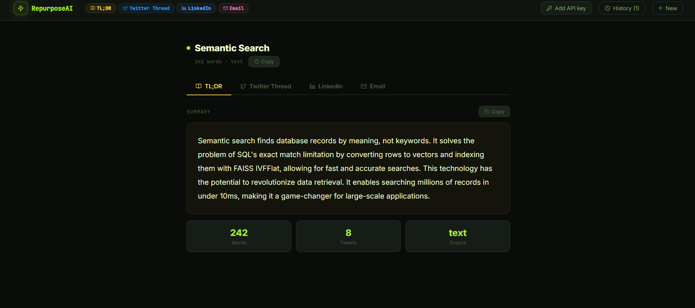
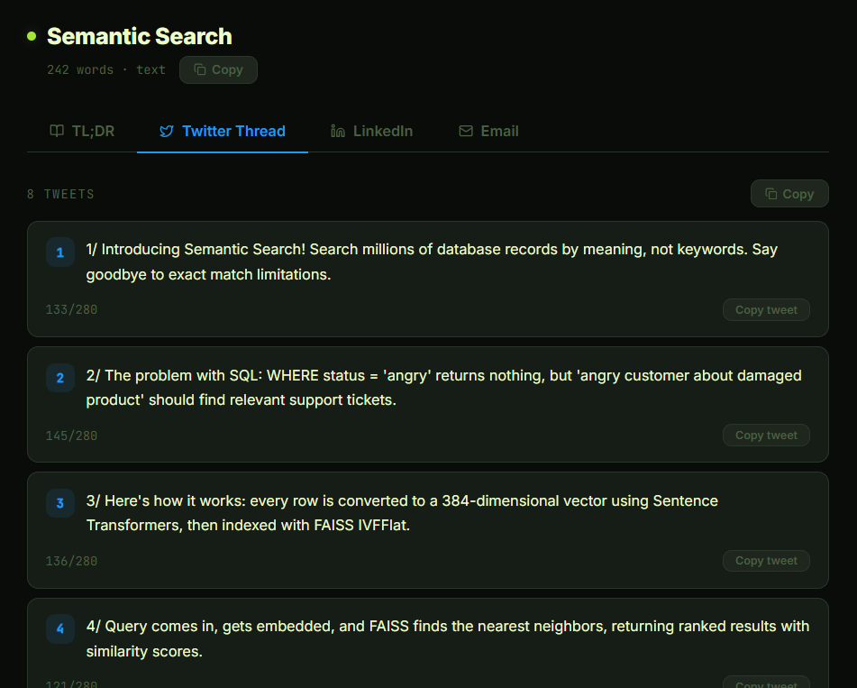
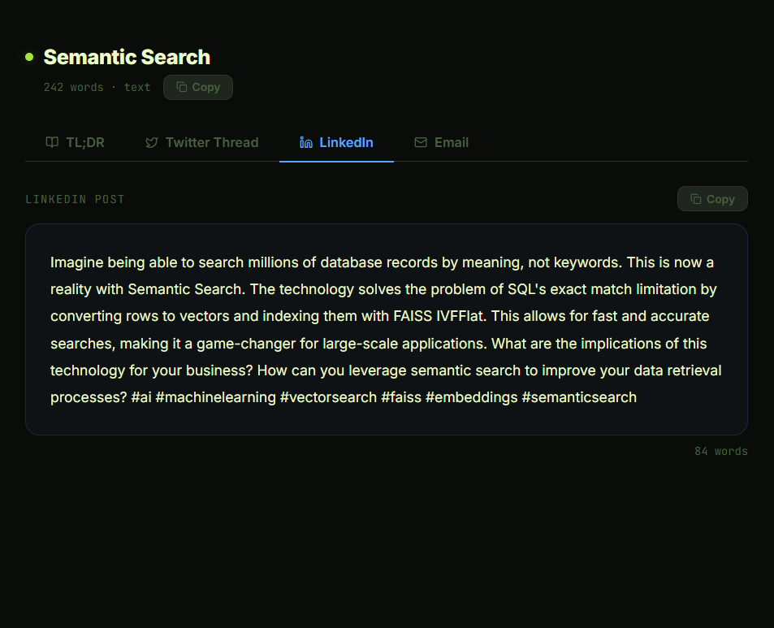
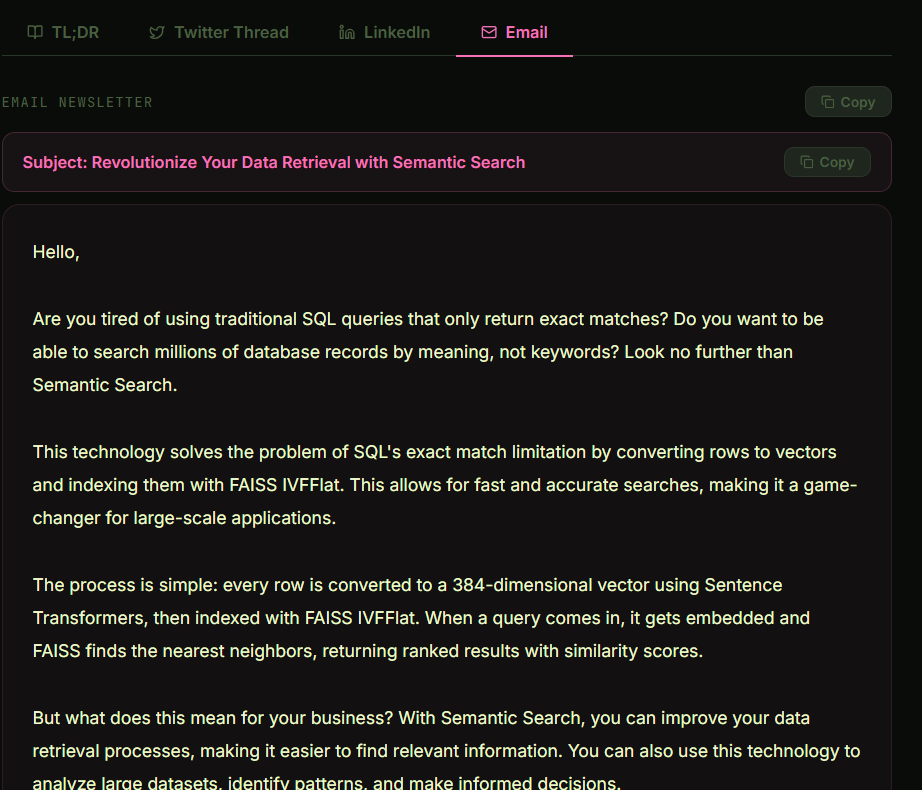

# RepurposeAI — AI Content Repurposer

Turn one blog post into 4 content formats instantly using Groq LLaMA 3.3.







---
FRONTEND_URL = https://repurposeai-nl23.onrender.com

## What it generates
- **TL;DR** — 3-4 sentence plain English summary
- **Twitter Thread** — 8 tweets with char counts, hook to CTA
- **LinkedIn Post** — 150-300 words with hook + engagement question
- **Email Newsletter** — Full email with subject line and CTA

## Inputs
- Paste text directly
- Enter a URL — content is fetched and extracted automatically

## Run

### Backend
```bash
cd backend
py -3.12 -m venv venv
venv\Scripts\activate
pip install -r requirements.txt
copy .env.example .env
# Add GROQ_API_KEY
uvicorn app.main:app --reload
```

### Frontend
```bash
cd frontend
npm install
npm run dev
```

## Git — First Push
```bash
cd repurpose
git init
git add .
git commit -m "day 22: RepurposeAI - AI content repurposer, one post to 4 formats"
git branch -M main
git remote add origin https://github.com/Susmithay08/RepurposeAI.git
git push -u origin main
```

## Deploy on Render

### Backend — Web Service
| Setting | Value |
|---------|-------|
| Root Directory | `backend` |
| Build Command | `pip install -r requirements.txt` |
| Start Command | `uvicorn app.main:app --host 0.0.0.0 --port $PORT` |
| Instance Type | Free tier works fine |

**Environment Variables:**
```
GROQ_API_KEY = your_key_here
FRONTEND_URL = https://your-frontend.onrender.com
```

### Frontend — Static Site
| Setting | Value |
|---------|-------|
| Root Directory | `frontend` |
| Build Command | `npm install && npm run build` |
| Publish Directory | `dist` |

**Environment Variables:**
```
VITE_API_URL = https://your-backend.onrender.com
```

## Stack
FastAPI · SQLAlchemy · Groq LLaMA 3.3 · React · Zustand · Framer Motion · SQLite · Render
